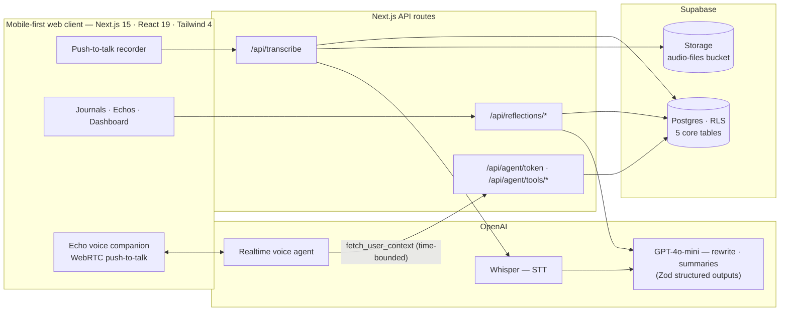

<div align="center">


# EchoJournal

**A voice-first journal that turns fragile voice notes into a personal, reflective memory.**

**English** · [简体中文](README.zh-CN.md)

[](https://nextjs.org)
[](https://react.dev)
[](https://www.typescriptlang.org)
[](https://tailwindcss.com)
[](https://supabase.com)
[](https://clerk.com)
[](https://platform.openai.com)

[](https://github.com/NoKV-Lab/NoKV)

</div>

---

**Evidence:** regular journaling and self-reflection measurably improve well-being.
**Reality:** most people abandon digital journaling within weeks.

Why? Typing long entries on a phone is tedious and cognitively heavy — worst on exactly the days *"when people have the most to say but the least patience to type."* Voice notes fix the capture problem, but they pile up as unstructured audio nobody ever replays. And handing your most personal thoughts to an opaque AI system feels wrong.

**So EchoJournal takes a different deal: just talk.**

Speak your day in two minutes. EchoJournal transcribes it, rewrites it into a clean first-person entry, distills it into structured reflections — and gives you a voice AI companion so you can literally *ask questions to your own past* and listen to the answers.

> *"Rather than treating voice notes as disposable recordings, EchoJournal treats them as primary input into a structured personal knowledge base."*

## Core design: three modules, one flow

### Module A — Daily Records: capture without friction


A daily mood check-in (day quality + emotions) feeds downstream summaries as an indexed mood signal. The voice journaling panel is push-to-record with a live waveform: tap, speak up to 10 minutes, tap **Process** — Whisper transcribes, an LLM restructures the rambling into a readable first-person entry, and everything lands in Postgres linked to your day.

### Module B — Echos: reflections that write themselves


Right after processing, EchoJournal aggregates your entries by day / week / month and generates **Echos** — swipeable, editable reflection cards built on three dimensions: **Achievements**, **Commitments**, and **Overall status** (mood + reason, flashbacks, themes). Model output is schema-validated (Zod structured outputs), and your manual edits are protected from regeneration.

### Module C — Echo, the voice-native AI companion


A realtime, push-to-talk voice agent (OpenAI Realtime over WebRTC) that answers questions like *"What patterns have you noticed in my mood recently?"* or *"What goals did I set after my Japan trip?"* — grounded in your own journal data.

> **Goal:** *"Let users 'ask and listen' to their structured memories, with constrained tools for interpretable and privacy-aware responses."*

### The flow, end to end


## Privacy by design: agentic tools, no RAG

The obvious 2025 architecture — dump every entry into a vector store and RAG over it — was **deliberately rejected**. Instead, the companion agent works through explicit, purpose-built tools inside temporary sessions:

- **`fetch_user_context`** — deterministic, *time-bounded* relational queries (today / last week / this month / custom). The agent sees only the slice it asks for, never the whole archive.
- **`web_search`** — optional supplemental search, capped by a daily quota.
- Sessions are ephemeral (token from `/api/agent/token`, 10-minute cap) — no long-lived agent memory.

> *"Data minimisation is enforced at the level of tool inputs, rather than relying solely on downstream model behaviour."*

And it's not hand-waving — here is the agent's actual decision loop, captured live in DevTools (average tool-call round trip **~2 seconds**):


## Architecture



**Stack:** Next.js 15 (App Router) · React 19 · TypeScript (strict) · Tailwind CSS 4 + shadcn/ui (Radix) · Zustand · Supabase (Postgres, Storage, RLS) · Clerk (auth) · OpenAI (Whisper STT, GPT summaries, Realtime agents via `@openai/agents`) · wavesurfer.js · Sentry · Vitest + Testing Library · deployed on Vercel.

## Results & honest limits

**What worked** (from evaluation during development):

- Voice-first capture is feasible and subjectively lighter than typing for short reflections; record → transcribe → summarise completes within a few seconds.
- Structured reflections help recall both *what happened* and *how it felt* over a period.
- Tool-bounded context supports genuinely useful AI conversations — without a monolithic, always-on retrieval memory.
- Test suite: ~60% line coverage overall; >90% on timezone & security helpers; 100% on agent search-quota and mood utilities.

**What's honestly not proven yet:** small-scale evaluation only — no long-term quantitative retention or mental-health outcome data; realtime audio paths partly rely on manual testing; privacy guarantees are pragmatic, not formally verified. The companion is a reflective assistant, not a clinical tool.

## Recognition

Built by [wchwawa](https://github.com/wchwawa), and selected for the **USYD Genesis Accelerator — Cohort 36** (~9% acceptance rate).

## Getting started

**Prerequisites:** Node 20+, pnpm (`corepack enable`), a modern browser with microphone access, plus accounts for [Supabase](https://supabase.com), [Clerk](https://clerk.com) (optional — keyless dev mode works), and [OpenAI](https://platform.openai.com).

```bash
git clone https://github.com/NoKV-Lab/journal-app-mvp.git
cd journal-app-mvp
pnpm install
cp .env.example .env.local
```

Fill in `.env.local`:

| Variable | Required | Notes |
|---|---|---|
| `NEXT_PUBLIC_SUPABASE_URL` / `NEXT_PUBLIC_SUPABASE_ANON_KEY` | ✅ | Supabase → Settings → API |
| `SUPABASE_SERVICE_ROLE_KEY` | ✅ | Server-only. Never expose client-side. |
| `OPENAI_API_KEY` | ✅ | Whisper + GPT + Realtime |
| `NEXT_PUBLIC_CLERK_PUBLISHABLE_KEY` / `CLERK_SECRET_KEY` | ◻️ | Leave empty for Clerk keyless dev mode |
| `NEXT_PUBLIC_CLERK_*_URL` (4 vars) | ✅ | Keep the defaults from `.env.example` |
| `NEXT_PUBLIC_APP_TIMEZONE` / `APP_TIMEZONE` | ✅ | IANA timezone, e.g. `Australia/Sydney` |
| `OPENAI_*_MODEL` (5 vars) | ◻️ | Model overrides — defaults in [`src/lib/ai/models.ts`](src/lib/ai/models.ts) |
| `NEXT_PUBLIC_SENTRY_*` / `SENTRY_AUTH_TOKEN` | ◻️ | Optional error tracking |

**Set up the database** — run the DDL below in the Supabase SQL editor, then create a Storage bucket named `audio-files`:

<details>
<summary><b>📄 Full schema (5 tables + indexes + RLS)</b></summary>

```sql
-- Enable required extension for UUID generation
create extension if not exists "pgcrypto";

-- audio_files
create table if not exists public.audio_files (
  id           uuid primary key default gen_random_uuid(),
  user_id      text not null,
  storage_path text not null,
  mime_type    text,
  duration_ms  integer,
  created_at   timestamptz default now()
);

-- transcripts
create table if not exists public.transcripts (
  id             uuid primary key default gen_random_uuid(),
  user_id        text not null,
  audio_id       uuid not null references public.audio_files (id) on delete cascade,
  text           text,
  rephrased_text text,
  language       text,
  created_at     timestamptz default now()
);

-- daily_question (daily mood)
create table if not exists public.daily_question (
  id          uuid primary key default gen_random_uuid(),
  user_id     text not null,
  day_quality text not null,
  emotions    text[] not null default '{}'::text[],
  created_at  timestamptz default now(),
  updated_at  timestamptz
);

create index if not exists daily_question_user_date_idx
  on public.daily_question (user_id, created_at);

-- daily_summaries
create table if not exists public.daily_summaries (
  id                uuid primary key default gen_random_uuid(),
  user_id           text not null,
  date              date not null,
  summary           text not null,
  entry_count       integer,
  mood_quality      text,
  mood_overall      text,
  mood_reason       text,
  dominant_emotions text[],
  achievements      text[],
  commitments       text[],
  flashback         text,
  stats             jsonb,
  gen_version       text,
  edited            boolean default false,
  created_at        timestamptz default now(),
  updated_at        timestamptz,
  last_generated_at timestamptz,
  constraint daily_summaries_user_date_unique unique (user_id, date)
);

create index if not exists daily_summaries_user_date_idx
  on public.daily_summaries (user_id, date);

-- period_reflections (Echos)
create table if not exists public.period_reflections (
  id                uuid primary key default gen_random_uuid(),
  user_id           text not null,
  period_type       text not null, -- 'daily' | 'weekly' | 'monthly'
  period_start      date not null,
  period_end        date not null,
  mood_overall      text,
  mood_reason       text,
  achievements      text[],
  commitments       text[],
  flashback         text,
  stats             jsonb,
  gen_version       text,
  edited            boolean default false,
  created_at        timestamptz default now(),
  updated_at        timestamptz,
  last_generated_at timestamptz,
  constraint period_reflections_unique
    unique (user_id, period_type, period_start, period_end)
);

create index if not exists period_reflections_user_period_idx
  on public.period_reflections (user_id, period_type, period_start, period_end);

-- Recommended Row-Level Security (review before applying;
-- policies assume auth.uid() matches user_id)
alter table public.audio_files enable row level security;
create policy "Audio owners can CRUD" on public.audio_files
  for all using (auth.uid()::text = user_id) with check (auth.uid()::text = user_id);

alter table public.transcripts enable row level security;
create policy "Transcript owners can CRUD" on public.transcripts
  for all using (auth.uid()::text = user_id) with check (auth.uid()::text = user_id);

alter table public.daily_summaries enable row level security;
create policy "Daily summaries owners can CRUD" on public.daily_summaries
  for all using (auth.uid()::text = user_id) with check (auth.uid()::text = user_id);

alter table public.period_reflections enable row level security;
create policy "Period reflections owners can CRUD" on public.period_reflections
  for all using (auth.uid()::text = user_id) with check (auth.uid()::text = user_id);

alter table public.daily_question enable row level security;
create policy "Daily question owners can CRUD" on public.daily_question
  for all using (auth.uid()::text = user_id) with check (auth.uid()::text = user_id);
```

</details>

**Run it:**

```bash
pnpm dev
```

Checks: `pnpm test` (Vitest), `pnpm typecheck`, `pnpm lint:strict` — all three also run in CI.

Open <http://localhost:3000>, sign in, then smoke-test the flow: mood check-in → record a short journal → **Process** → check `/dashboard/journals` → generate an Echo at `/dashboard/echos` → talk to the voice companion.

Hitting issues? See [`docs/troubleshooting.md`](docs/troubleshooting.md).

## Documentation map

| Doc | What's inside |
|---|---|
| [`docs/project-specs.md`](docs/project-specs.md) | Module-by-module product spec |
| [`docs/design-guideline.md`](docs/design-guideline.md) | "Intelligent minimalism" design language |
| [`docs/security-doc.md`](docs/security-doc.md) | Auth, RLS, origin checks, dev flags |
| [`docs/development-journal/`](docs/development-journal/) | Per-module engineering journals |
| [`docs/testing-doc/`](docs/testing-doc/) | Test plan & results |

## Roadmap

- Will be supported by [NoKV](https://github.com/NoKV-Lab/NoKV) — an agent-native distributed workspace & artifact store — for durable agent workspace state
- Structured user studies: adherence, effort, and well-being over weeks/months
- Offline-first capture (store-and-forward) and journaling reminders
- Crisis-phrase detection & escalation for the companion
- Playwright E2E coverage; observability (structured logging + metrics)
- Formal threat modelling, granular retention controls, client-side encryption

## License & credits

MIT. UI scaffolding began from [next-shadcn-dashboard-starter](https://github.com/Kiranism/next-shadcn-dashboard-starter) (see [LICENSE](LICENSE)); everything voice, AI, and journaling is original work by [wchwawa](https://github.com/wchwawa).

> *EchoJournal — because some days you have the most to say and the least patience to type.*
