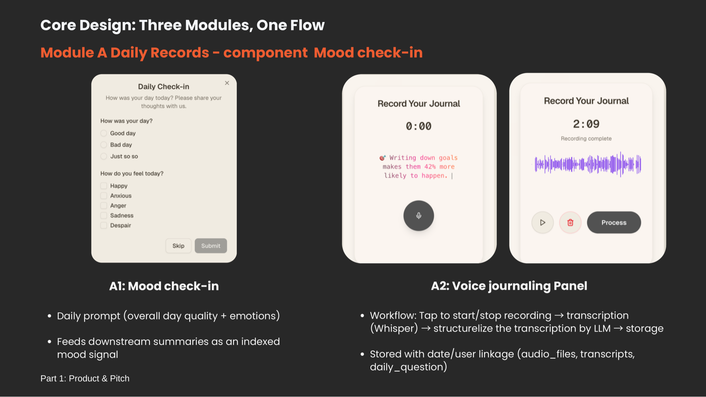
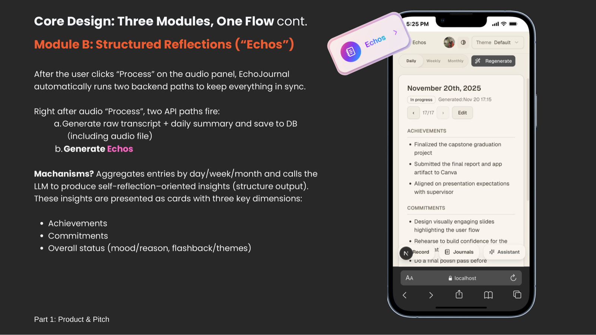
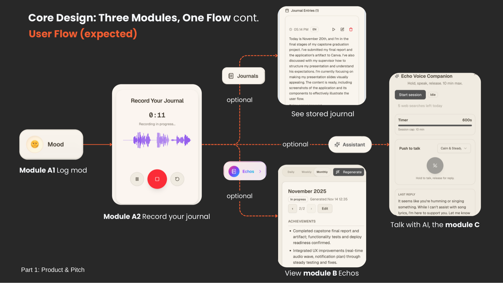
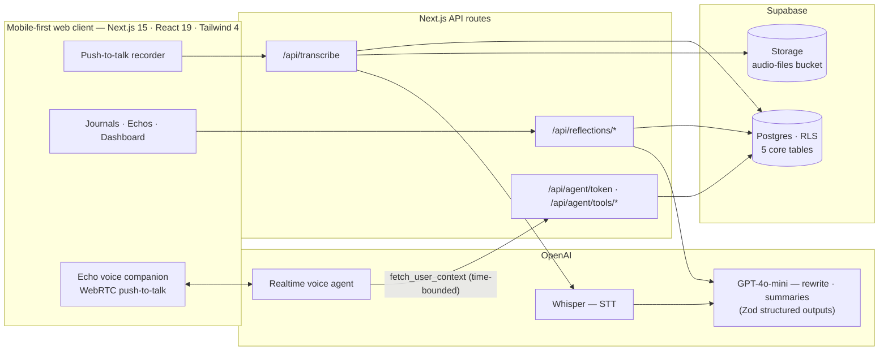

<div align="center">


# EchoJournal

**一款语音优先的日记应用，把转瞬即逝的语音便签变成可回溯、可对话的个人记忆。**

[English](README.md) · **简体中文**

[](https://nextjs.org)
[](https://react.dev)
[](https://www.typescriptlang.org)
[](https://tailwindcss.com)
[](https://supabase.com)
[](https://clerk.com)
[](https://platform.openai.com)

[](https://github.com/NoKV-Lab/NoKV)

</div>

> [!NOTE]
> 本中文文档由 AI 直译生成，暂未经人工校对，若有疏漏敬请谅解。内容以 [英文版](README.md) 为准。

---

**证据：** 规律的日记与自我反思能切实改善身心状态。
**现实：** 大多数人在几周内就放弃了数字日记。

为什么？在手机上打长篇日记既繁琐又耗费心力——尤其在那些*"最有话要说、却最没耐心打字"*的日子里。语音便签解决了记录问题，却堆积成无人回放的杂乱音频。而把最私密的想法交给一个不透明的 AI 系统，总让人心里不安。

**所以 EchoJournal 换了一种方式：开口说就好。**

花两分钟说说你的一天。EchoJournal 负责转写，改写成通顺的第一人称日记，再提炼为结构化的反思卡片——还配有一位语音 AI 伙伴，让你真的可以*向自己的过去提问*，并听到答案。

> *"EchoJournal 不把语音便签当作用完即弃的录音，而是把它们视为构建结构化个人知识库的第一手输入。"*

## 核心设计：三大模块，一条流程

### 模块 A —— 每日记录：无摩擦的捕捉



每日心情打卡（当天状态 + 情绪多选）作为带索引的情绪信号汇入下游总结。语音日记面板即按即录、实时显示波形：轻点开始，最长可说 10 分钟，再点 **Process**——Whisper 完成转写，LLM 把口语化的表达重组为通顺的第一人称日记，全部数据按天关联写入 Postgres。

### 模块 B —— Echos：会自己生成的反思



处理完成后，EchoJournal 随即按日 / 周 / 月聚合你的记录，生成 **Echos**——可滑动、可编辑的反思卡片，围绕三个维度构建：**成就（Achievements）**、**承诺（Commitments）** 与 **整体状态**（心情与原因、闪回、主题）。模型输出经过 schema 校验（Zod 结构化输出），你的手动编辑不会被重新生成覆盖。

### 模块 C —— Echo：语音原生的 AI 伙伴


一个实时、按住即说的语音 agent（OpenAI Realtime，基于 WebRTC），可以回答诸如*"最近我的情绪有什么规律？"*、*"日本之行后我立过哪些目标？"*这样的问题——答案全部扎根于你自己的日记数据。

> **目标：***"让用户能对自己的结构化记忆'开口提问、侧耳倾听'，并通过受约束的工具给出可解释、隐私友好的回答。"*

### 端到端流程



## 隐私优先的设计：Agent 工具化，而非 RAG

那条 2025 年的"标准路线"——把所有日记塞进向量库再做 RAG——被**有意舍弃**了。取而代之，AI 伙伴只能在临时会话中通过明确的专用工具访问数据：

- **`fetch_user_context`** —— 确定性的、*限定时间范围*的关系型查询（今天 / 上周 / 本月 / 自定义）。Agent 只能看到它请求的那一小片数据，永远接触不到完整档案。
- **`web_search`** —— 可选的补充搜索，受每日配额限制。
- 会话即用即弃（token 由 `/api/agent/token` 签发，单次上限 10 分钟）——不存在长期驻留的 agent 记忆。

> *"数据最小化在工具输入层强制执行，而不是仅仅寄希望于下游模型的自觉。"*

这并非空谈——下图是 DevTools 实拍的 agent 决策闭环（工具调用平均往返 **约 2 秒**）：


## 架构



**技术栈：** Next.js 15（App Router）· React 19 · TypeScript（strict）· Tailwind CSS 4 + shadcn/ui（Radix）· Zustand · Supabase（Postgres、Storage、RLS）· Clerk（认证）· OpenAI（Whisper 语音转写、GPT 总结、`@openai/agents` 实时语音 agent）· wavesurfer.js · Sentry · Vitest + Testing Library · 部署于 Vercel。

## 成果与坦诚的边界

**已验证的**（来自开发期间的评估）：

- 语音优先的记录切实可行，对简短反思而言主观上比打字轻松；录音 → 转写 → 总结全程在数秒内完成。
- 结构化反思有助于回忆一段时间里*发生了什么*以及*当时的感受*。
- 工具限界的上下文足以支撑真正有用的 AI 对话——无需一个庞大、常驻的检索记忆。
- 测试：整体行覆盖率约 60%；时区与安全工具函数 >90%；agent 搜索配额与心情工具函数 100%。

**尚未验证的（如实说明）：** 目前仅有小规模评估——缺少长期定量的留存与心理健康结果数据；实时语音链路部分依赖手动测试；隐私保证属务实取向，未经形式化验证。这位 AI 伙伴是反思助手，不是临床工具。

## 项目背景

由 [wchwawa](https://github.com/wchwawa) 打造，入选 **USYD Genesis 加速器——第 36 期**（录取率约 9%）。

## 快速开始

**环境要求：** Node 20+、pnpm（`corepack enable`）、支持麦克风的现代浏览器，以及 [Supabase](https://supabase.com)、[Clerk](https://clerk.com)（可选——支持 keyless 开发模式）和 [OpenAI](https://platform.openai.com) 账号。

```bash
git clone https://github.com/NoKV-Lab/EchoJournal.git
cd EchoJournal
pnpm install
cp .env.example .env.local
```

填写 `.env.local`：

| 变量 | 必填 | 说明 |
|---|---|---|
| `NEXT_PUBLIC_SUPABASE_URL` / `NEXT_PUBLIC_SUPABASE_ANON_KEY` | ✅ | Supabase → Settings → API |
| `SUPABASE_SERVICE_ROLE_KEY` | ✅ | 仅限服务端，绝不能暴露到客户端 |
| `OPENAI_API_KEY` | ✅ | Whisper + GPT + Realtime |
| `NEXT_PUBLIC_CLERK_PUBLISHABLE_KEY` / `CLERK_SECRET_KEY` | ◻️ | 留空即可使用 Clerk keyless 开发模式 |
| `NEXT_PUBLIC_CLERK_*_URL`（4 个变量） | ✅ | 保持 `.env.example` 中的默认值 |
| `NEXT_PUBLIC_APP_TIMEZONE` / `APP_TIMEZONE` | ✅ | IANA 时区名，如 `Australia/Sydney` |
| `OPENAI_*_MODEL`（5 个变量） | ◻️ | 模型覆盖项——默认值见 [`src/lib/ai/models.ts`](src/lib/ai/models.ts) |
| `NEXT_PUBLIC_SENTRY_*` / `SENTRY_AUTH_TOKEN` | ◻️ | 可选的错误追踪 |

**初始化数据库** —— 在 Supabase SQL 编辑器中执行以下 DDL，并创建名为 `audio-files` 的 Storage bucket：

<details>
<summary><b>📄 完整表结构（5 张表 + 索引 + RLS）</b></summary>

```sql
-- Enable required extension for UUID generation
create extension if not exists "pgcrypto";

-- audio_files
create table if not exists public.audio_files (
  id           uuid primary key default gen_random_uuid(),
  user_id      text not null,
  storage_path text not null,
  mime_type    text,
  duration_ms  integer,
  created_at   timestamptz default now()
);

-- transcripts
create table if not exists public.transcripts (
  id             uuid primary key default gen_random_uuid(),
  user_id        text not null,
  audio_id       uuid not null references public.audio_files (id) on delete cascade,
  text           text,
  rephrased_text text,
  language       text,
  created_at     timestamptz default now()
);

-- daily_question (daily mood)
create table if not exists public.daily_question (
  id          uuid primary key default gen_random_uuid(),
  user_id     text not null,
  day_quality text not null,
  emotions    text[] not null default '{}'::text[],
  created_at  timestamptz default now(),
  updated_at  timestamptz
);

create index if not exists daily_question_user_date_idx
  on public.daily_question (user_id, created_at);

-- daily_summaries
create table if not exists public.daily_summaries (
  id                uuid primary key default gen_random_uuid(),
  user_id           text not null,
  date              date not null,
  summary           text not null,
  entry_count       integer,
  mood_quality      text,
  mood_overall      text,
  mood_reason       text,
  dominant_emotions text[],
  achievements      text[],
  commitments       text[],
  flashback         text,
  stats             jsonb,
  gen_version       text,
  edited            boolean default false,
  created_at        timestamptz default now(),
  updated_at        timestamptz,
  last_generated_at timestamptz,
  constraint daily_summaries_user_date_unique unique (user_id, date)
);

create index if not exists daily_summaries_user_date_idx
  on public.daily_summaries (user_id, date);

-- period_reflections (Echos)
create table if not exists public.period_reflections (
  id                uuid primary key default gen_random_uuid(),
  user_id           text not null,
  period_type       text not null, -- 'daily' | 'weekly' | 'monthly'
  period_start      date not null,
  period_end        date not null,
  mood_overall      text,
  mood_reason       text,
  achievements      text[],
  commitments       text[],
  flashback         text,
  stats             jsonb,
  gen_version       text,
  edited            boolean default false,
  created_at        timestamptz default now(),
  updated_at        timestamptz,
  last_generated_at timestamptz,
  constraint period_reflections_unique
    unique (user_id, period_type, period_start, period_end)
);

create index if not exists period_reflections_user_period_idx
  on public.period_reflections (user_id, period_type, period_start, period_end);

-- Recommended Row-Level Security (review before applying;
-- policies assume auth.uid() matches user_id)
alter table public.audio_files enable row level security;
create policy "Audio owners can CRUD" on public.audio_files
  for all using (auth.uid()::text = user_id) with check (auth.uid()::text = user_id);

alter table public.transcripts enable row level security;
create policy "Transcript owners can CRUD" on public.transcripts
  for all using (auth.uid()::text = user_id) with check (auth.uid()::text = user_id);

alter table public.daily_summaries enable row level security;
create policy "Daily summaries owners can CRUD" on public.daily_summaries
  for all using (auth.uid()::text = user_id) with check (auth.uid()::text = user_id);

alter table public.period_reflections enable row level security;
create policy "Period reflections owners can CRUD" on public.period_reflections
  for all using (auth.uid()::text = user_id) with check (auth.uid()::text = user_id);

alter table public.daily_question enable row level security;
create policy "Daily question owners can CRUD" on public.daily_question
  for all using (auth.uid()::text = user_id) with check (auth.uid()::text = user_id);
```

</details>

**启动：**

```bash
pnpm dev
```

检查命令：`pnpm test`（Vitest）、`pnpm typecheck`、`pnpm lint:strict`——三者同样运行在 CI 中。

打开 <http://localhost:3000> 并登录，然后按流程冒烟测试：心情打卡 → 录一段简短日记 → **Process** → 查看 `/dashboard/journals` → 在 `/dashboard/echos` 生成 Echo → 与语音伙伴对话。

遇到问题？参见 [`docs/troubleshooting.md`](docs/troubleshooting.md)。

## 文档地图

| 文档 | 内容 |
|---|---|
| [`docs/project-specs.md`](docs/project-specs.md) | 按模块拆分的产品规格 |
| [`docs/design-guideline.md`](docs/design-guideline.md) | "智性极简"设计语言 |
| [`docs/security-doc.md`](docs/security-doc.md) | 认证、RLS、来源校验、开发开关 |
| [`docs/development-journal/`](docs/development-journal/) | 各模块的工程开发日志 |
| [`docs/testing-doc/`](docs/testing-doc/) | 测试计划与结果 |

## 路线图

- 将由 [NoKV](https://github.com/NoKV-Lab/NoKV) 提供支持——一个 Agent 原生的分布式工作空间与制品存储——用于持久化 agent 工作空间状态
- 结构化用户研究：数周 / 数月尺度上的坚持度、投入成本与身心收益
- 离线优先的录音采集（暂存转发）与日记提醒
- AI 伙伴的危机语句检测与升级机制
- Playwright 端到端测试覆盖；可观测性（结构化日志 + 指标）
- 正式威胁建模、细粒度数据保留控制、客户端加密

## 许可证与致谢

MIT。UI 脚手架源自 [next-shadcn-dashboard-starter](https://github.com/Kiranism/next-shadcn-dashboard-starter)（见 [LICENSE](LICENSE)）；语音、AI 与日记相关的一切均为 [wchwawa](https://github.com/wchwawa) 的原创工作。

> *EchoJournal——因为总有那么一些日子，你最有话要说，却最没耐心打字。*
